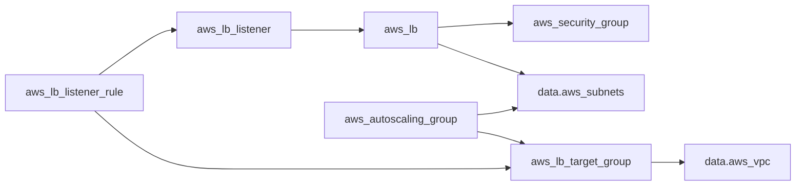

#TODO

# VPC
https://repost.aws/questions/QUK_vSmINHSXCC8oVwe3DVsA/aws-theory-why-an-ec2-need-a-vpc
https://docs.aws.amazon.com/vpc/latest/userguide/what-is-amazon-vpc.html

default vpc are all public subnets, i.e. accessible from public internet
# Subnet

# CIDR
https://medium.com/@hildamachando4/cidr-blocks-in-aws-understanding-the-basics-and-beyond-f74506a84b83

# Open Systems Interconnection (OSI)

# load balancer terraform resource required
the diagram indicates what resource mentions what resource

# other 
> [!NOTE]
> by default all aws resources, including alb dont allow income or outgoing traffic, so they need security group definition.
