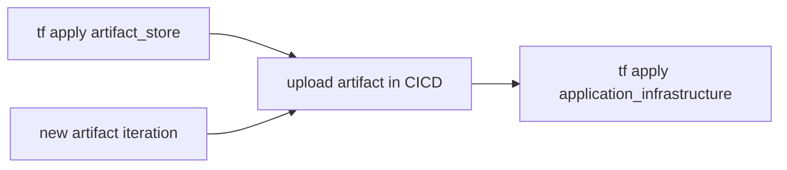

CI/CD is defined as a set of development practices that enable the rapid and reliable delivery of code changes. [[DevOps]] is defined as a collection of ideas, practices, processes, and technologies that allow development and operations teams to work together to streamline product development. While the two concepts are related, they are different in many ways.
source: [cicd vs devops | spiceworks](https://www.spiceworks.com/tech/devops/articles/cicd-vs-devops/)

# best practices

Artefacts like container images, aws lambda code, aws lambda layer are not considered infrastructure and should not be deployed using terraform (infrastructure as code)

the upload artifact part could be github workflow or mocked using #Makefile locally.

So the infrastructure - application deployment process should look like the following 

