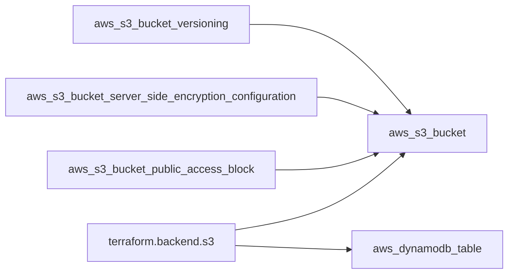

# Terraform: up & running by Yevgeniy Brikman (edition 3) notes
> [!NOTE]
> this book uses #aws for example. 
> the prerequisite for Certificate `HashiCorp Certified: Terraform Authoring and Operations Professional` is experience with aws in production environment
>


## chapter 1 why terraform
- [[DevOps]] is not a job title, it's a set of processes, ideas, techniques.
> [!TIP]
> The goal of DevOps is to make software delivery vastly more efficient.
> 
> CICD 

### 4 core values to devops 
- culture, 
- automation, 
- measurement, 
- sharing 

> [!NOTE]
> This book focus on automation

### Five broad categories of IaC tools:
- Ad hoc scripts
  - e.g.
    - bash script
    - ruby
    - python
  - issues
    - too much freedom in style and method
- Configuration management tools
  - e.g.
    - chef
    - puppet
    - ansible
  - benefit
    - coding convention
    - idempotence:
      - result guaranteed on repetition
    - distribution
- Server templating tools
  - e.g.
    - docker (container)
    - coreos rkt (container)
    - cri-o (container)
    - podman (container)
    - packer (vm) (prod cloud)
    - vagrant (vm) (dev vbox)
  - 1 example of pattern flow :
    1. packer --> aws ami with docker engine, 
    2. deploy ami to cluster of server, 
    3. deploy docker container across that cluster
  > [!TIP] 
  > key component to immutable infrastructure
- Orchestration tools
  - e.g.
    - k8s
    - marathon/mesos 
    - ecs
    - docker swarm
    - nomad 
- Provisioning tools
  - terraform
  - cloud formation
  - openstack heat
  - aws cdk
  - arm template (azure)
  - pulumi

IaC introduces software engineering practices
- self-service
- speed and safety 
- documentation
- version control
- validation
- reuse
- happiness

> [!NOTE] 
> Terraform written in Go.

### Tradeoff comparison with other tools

#### Configuration management versus provisioning
- Differentiation between config and provision may not be clear cut as some config can be done during provisioning and vice versa.
- Common pattern is provision (terraform) + server template (docker)
- Can also do provision (terraform) + config management (ansible)

#### Mutable infrastructure versus immutable infrastructure
- config management tool by default are stateful/mutable
- mutable downside:
  - cumulative history in `prod` that will not be reflected in `dev`
- immutable downside:
  - time intensive to redeploy for trivial change.
  - once disk is running, the disk will cumulate data and config, becoming stateful.
#### Procedural language versus declarative language
terraform, cf, puppet openstack heat, pulumi are declarative
chef and ansible are procedural

procedural downside:
  - does not capture state
  - limits reusability

#### General-purpose language versus domain-specific language

**Advantage of each**
| dsl                      | gpl                                      |
| :----------------------- | :--------------------------------------- |
| easier to learn          | no need to learn anything new            |
| clearer and more concise | bigger ecosystem and more mature tooling |
| more uniform             | more power and functionality (loop, conditional, autotest, code reuse, abstraction, integration with other tools)       | 

#### Master versus masterless
**Master's pro con table**
| advantage                                              | disadvantage |
| :----------------------------------------------------- | :----------- |
| single place to see status                             | extra infra  |
| potential web interface                                | maintenance  |
| continuous run in background to check for config drift | security (connection to client) |


#### Agent versus agentless
- agent is software on server that does the configuration

**Agent's pro con table**

| advantage | disadvantage                                                                                                        |
| :-------- | :------------------------------------------------------------------------------------------------------------------ |
|           | bootstraping (how to orchestrate agent itself in the first place? external dependency or unnatural bootstrap?)      |
|           | maintenance (sync with master and monitor for crash) more moving part is more chance of failure and timely to debug |
|           | security (connection to master)                                                                                     |

#### Paid versus free offering
> [!WARNING] 
> teraform is no longer open source, still free. Consider using open tofu (an open source fork of terraform) as an alternative.
> https://spacelift.io/blog/terraform-license-change#what-is-the-likely-impact-of-the-terraform-bsl-license-change

- pulumi free is said to be not production ready. It needs the paided pulumi backend to support transactional checkpointing for fault tolerance and recovery, concurrent state locking (prevent team overriding causing corruption), encrypt state in transit and at rest

#### Large community versus small community
- to check community size, check 
  - github contributor
  - github star
  - downstream libraries
  - stack overflow questions
  - multi cloud support
  - open or closed source
  - 
#### Mature versus cutting-edge
how stable and old is the tool

#### Use of multiple tools together
**common patterns**
- provisioning + config management
- provisioning + server templating
- provisioning + server templating + orchestration

#### summary:
|              | chef        | Puppet      | Ansible     | Pulumi       | CloudFormation | Heat         | Terraform        | OpenTofu                       |
| :----------- | :---------- | :---------- | :---------- | :----------- | :------------- | :----------- | :--------------- | :----------------------------- |
| Source       | Open        | Open        | Open        | Open         | Closed         | Open         | Source available | Open                           |
| Cloud        | All         | All         | All         | All          | AWS            | All          | All              | All                            |
| Type         | Config mgmt | Config mgmt | Config mgmt | Provisioning | Provisioning   | Provisioning | Provisioning     | Provisioning                   |
| Infra        | Mutable     | Mutable     | Mutable     | Immutable    | Immutable      | Immutable    | Immutable        | Immutable                      |
| Paradigm     | Procedural  | Declarative | Procedural  | Declarative  | Declarative    | Declarative  | Declarative      | Declarative                    |
| Language     | GPL         | DSL         | DSL         | GPL          | DSL            | DSL          | DSL              | DSL                            |
| Master       | Yes         | Yes         | No          | No           | No             | No           | No               | No                             |
| Agent        | Yes         | Yes         | No          | No           | No             | No           | No               | No                             |
| Paid Service | Optional    | Optional    | Optional    | Must-have    | N/A            | N/A          | Optional         | N/A                            |
| Community    | Large       | Large       | Huge        | Small        | Small          | Small        | Huge             | Large (half star as terraform) |
| Maturity     | High        | High        | Medium      | Low          | Medium         | Low          | Medium           | Medium                         |

author from https://www.gruntwork.io/, also now support OpenTofu

## chapter 2 getting started
### Tutorial/chapter Outline
- setting up aws account
- install terraform (locally)
- deploy single server
- deploy configurable web server
- deploy cluster of web server
- deploy load balancer 
- clean up

### command takeaway
- `terraform init` is idempotent, and run everytime looking at new code
- `terraform plan` review proposed change before `apply`
  - +/- indicates resource that is getting replace
  - text saying `force replace` from `terraform plan` shows what causes the change
- to see dependency, do `terraform graph`
- `graph` text output can be visualized using graphviz
- `destroy` removes the resources defined in a terraform code base
> [!CAUTION]
> rarely if ever, run `destroy` in production
### code takeaway
- terraform `resource` come from providers.
- `resource` have `tags`
- `resource` interdepends and terraform can figure out the dependency and what to build first.
- `variable` keeps code DRY (dont repeat yourself)
  - have optional configs:
    - description
    - default
      - can receive from cmd, file, env var (TF_VAR_VNAME)
    - type 
    - validation
    - sensitive
- interpolation allow you to put variable inside a string literal (e.g. user script to run on initiation of ec2), like python format string. Syntax: `${...}`
- `output` are used to store fields that are only generated after a resource is created.
  - optional config:
    - name
    -  description
    -  sensitive
       -  whether to not print it in the log (i.e. secret or password)
    -  depends_on
- resource `lifecycle`
  - when config to resource changes, and it is referenced else where. by default the original resource can't get destroyed due to the reference.
  - to fix this, use `lifecycle` rule `create_before_destroy` such that the replacement is created and then substitute the old resource, and then the old resource will be destroyed.
- data source
  - a piece of read-only information that is fetched from the provider
  - For example, the AWS Provider includes data sources to look up VPC data, subnet data, AMI IDs, IP address ranges, the current user’s identity, and much more
  - optional configs are search parameters using the provider api

### other knowledge
> [!NOTE]
> The only servers you should run in public subnets are a small number of reverse proxies and load balancers that you lock down as much as possible

## chapter 3 manage state
- state should not be checked in
### chapter outline
- shared storage for state files
- limitation with tf backend
- state file isolation
- `terraform_remote_state` data source

# takeaway
on off-chance that one need to edit the state file manually, use `terraform import` or `terraform state` cmd - see chapter 5

state file challenges:
- shared storage
- locking during concurrent apply
- isolating state between environments

issue with version control state and resolved via remote backend:
|     | manual error                           | locking                                              | secrets                                                            |
| :-- | :------------------------------------- | :--------------------------------------------------- | :----------------------------------------------------------------- |
| git | very easy to forget git pull           | git doesn't do this                                  | state is stored as plain text                                      |
| remote backend  | state loaded automatically via backend | most remote backend like s3 support locking natively | encrypt during transit and at rest. Also support access iam config |
| s3 (example of remote) | managed service, high durability and availability, versioning for rollback | locking via dynamoDB | server side encrypt with AES256, transit encrypt with TLS |

bucket as remote backend reference diagram (separate tf folder)
> [!NOTE] 
> the reference could be via resource tf name or attributes, to see which see book and docs.




### limitation with tf backend
1. chicken and egg
  - need to
    1. deploy the s3 bucket and dynamo db with local backend
    2. add remote backend to main infra use new s3 and dynamo db
  - to delete
    1. remove backend config from main infra and run `terraform init` to copy state to local disk
    2. run `terraform destroy` to delete the s3 and dynamo db table

  - one can share s3 bucket and table for all terraform code, i.e. creation only needs to be done once.
2. `backend` code block does not support variables or references.
   - native solution:
     - but one can create a `backend.hcl` file and call that in `terraform init -backend-config=backend.hcl` (page 92)
     - `key` for each state should still be unique and cant be refactored out
       - otherwise it will override and destroy state of other stacks.
   - use `terragrunt`

> [!TIP] 
> Maybe to document future project, explore method to visualize graphviz in markdown (`terraform graph` output graphviz text)
> - [x] 1st stage explore done in [[Diagrams as Code.md]]

### isolation via workspaces
- 1 quick method to separate state between environments like `dev` `staging` `prod`
  - quick and dirty
  - doesn't highlight well which env `apply` ing to.
  - prone to human error
  - in s3 different sub folder/key is created for different workspaces, doesnt do this for default workspace
  - can use ternary operator to change different config in resource (i.e. ec2 instance size) base on workspace
    - `terrform.workspace == "default" ? "t2.medium" : "t2.micro"`
- `terraform workspace show`
- `terraform workspace new wpname`
- `terraform plan` doesn't show workspace name in plan
- `terraform workspace list` 
- `terraform workspace select default` switch between created workspaces

major drawbacks:
- all stored in the same backend (cant do separate authentication and access control for isolated env)
- not visible in code
- hence easily destroy `prod` 

### isolation via file layout
- use folder for differnent env/component
- different backend for different folder and env
```
stage (testing)
  vpc
  services
    frontend-app
    backend-app
      variables.tf
      outputs.tf
      main.tf
  data-storage
    mysql
    redis
prod (user facing)
  vpc
  services
    frontend-app
    backend-app
  data-storage
    mysql
    redis
mgmt (devops tooling)
  vpc
  services
    bastion-host
    jenkins
global (shared resources) (i.e. backend bucket and dynamo table)
  iam
  s3
```

The below 3 file is the minimum convention for splitting.
```
variables.tf
outputs.tf
main.tf
```
they can be divided up further into
```
dependencies.tf (external stuff) (I'm thinking data sources and external resources)
providers.tf
main-xxx
  iam.tf
  s3.tf
```

| advantage                 | disadvantage                                                                                                  | how to address disadvantage                                                    |     |
| :------------------------ | :------------------------------------------------------------------------------------------------------------ | :----------------------------------------------------------------------------- | :-- |
| clear code/env layout     | cant create entire stack in 1 command                                                                         | `terragrunt` have `run-all` command                                            |     |
| isolation minimize damage | code duplication                                                                                              | can be resolved using module. see chapter 4                                    |     |
|                           | resource dependency visibility (cant reference things via aws_db_instance.foo.address if in different folder) | use terraform_remote_state data source. use `dependency` block in `terragrunt` |     |

### `terraform_remote_state` data source 
- quick and dirty 
  - use variable with sensitive to input secrets (e.g. passwords and username)
- outputs are stored in state file as well
- how to reference attribute post declaration
  - `data.terraform_remote_state.<NAME>.outputs.<ATTRIBUTE>`
- `terraform console` is read-only
- `data sources` are read-only
- `templatefile` function allow you to use write user_scripts outside of .tf files to keep the code clean and reusable.


## chapter 4 reusable module
- Input and output variables are also essential ingredients in creating configurable and reusable infrastructure code


## chapter 5 tips and tricks loops, ifs, deploy and gotcha
- zero down time deploy

## chapter 6 managing secrets

## chapter 7 multi providers

## chapter 8 production grade terraform code
- lock file (can be checked)
- variable validation beyond basic type check (e.g. range)

## chapter 9 testing terraform code

## chapter 10 use terraform as a team
